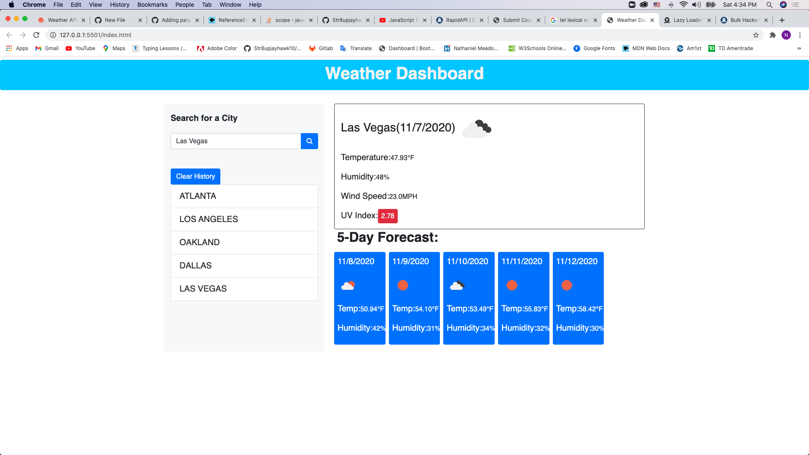

# weather-dashboard
dynamic weather app that shows current time and data
HTML, CSS, & Javascript(JQuery) language is what was used to build this weather dashboard. When searching a city of choice for current weather update. 
This application displays current date, humidity, uv index, temperature, and wind speed, but also will give you an update on the incoming weather.
Declared a varible to cache city search, four loop to search if cities exist within storage, created API keys, fetch method to display weather coordinates using
openweathermap.org, parse response for name of city, date, and icons. Display current temp set to fahrenheit, humidity, and wind speed set to miles per hour.

#Screen shot
![image]

